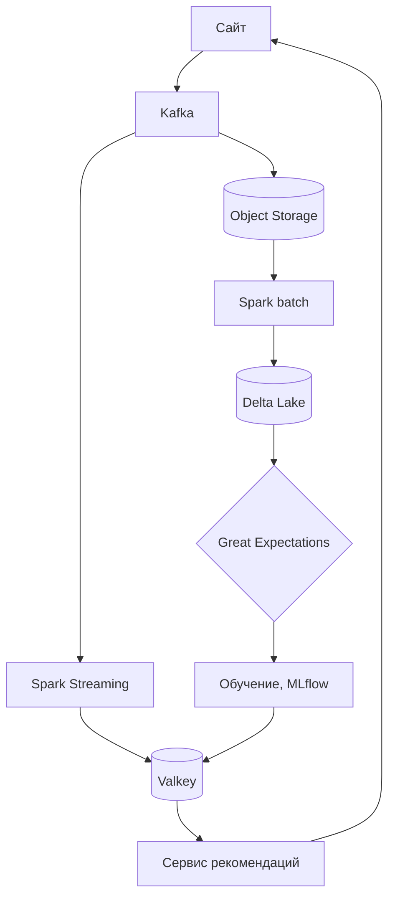

# Лабораторная работа №1
# Выполнил студент группы МОАм-251 Козырев А.Д.

Анализ кликстрима интернет-магазина по критериям 5V: подходят ли данные для рекомендательной системы, какой нужен стек и окупится ли решение. Расчёты и графики приведены в ноутбуке `Lab_BigData_1.ipynb`.

**Источник данных:** [eCommerce behavior data from multi category store](https://www.kaggle.com/datasets/mkechinov/ecommerce-behavior-data-from-multi-category-store) (Kaggle).

**Датасет:** E-commerce Clickstream, файл `2019-Oct.csv` (Kaggle, mkechinov): все события магазина за октябрь 2019 года (просмотры, корзины, покупки), 5,3 ГБ.

**Сценарий:** рекомендательная система (средний чек +15%, инференс < 100 мс). В данных есть пары «пользователь-товар», цена покупки и сессии, поэтому цель измерима на этих же данных. Для остальных сценариев нет нужных полей: разметки мошенничества, остатков, логов.

## Часть 1. Volume

- Объём: 5 668 612 855 байт (5,28 ГБ), 42 448 764 события за 31 день, 133,5 байта на строку.
- Форматы (оценка по выборке в 1 млн строк, проверена на полном файле: оценка завышена на 6%):

| Формат | Месяц, ГБ | Сжатие |
|---|---|---|
| CSV | 5,28 | 1,0x |
| Avro snappy / deflate | 2,67 / 2,00 | 2,0x / 2,6x |
| Parquet snappy | 1,34 | 3,9x |
| Parquet zstd | 0,66 | 8,0x |

- 42% объёма Parquet занимает `user_session`: 9,2 млн разных UUID, словарное кодирование к ним не применяется. Zstd находит повторы сессий в потоке, snappy нет, поэтому snappy вдвое хуже.
- Рост: 1,37 млн событий в день (174 МБ CSV, 22 МБ Parquet). Год: 62 ГБ CSV, 7,8 ГБ Parquet. До 1 ТБ в CSV при текущем темпе 198 месяцев, при тренде октября (+2,1% в месяц) 79 месяцев. Чтобы дойти до 1 ТБ за 3 года, нужен рост 7,9% в месяц.
- Горячими держим 30 дней всех событий и 12 месяцев покупок и корзин (27 МБ в месяц). Просмотры старше 30 дней уходят в холодное хранилище: модели они уже не помогают (Часть 5).
- Хранение года в Yandex Object Storage: 92 ₽ в стандартном классе, 54 ₽ со схемой «последний месяц в стандартном, остальное в холодном».
- Pandas тратит на событие около 285 байт при строках-объектах (по умолчанию в pandas 2) и 118 байт при строках в Arrow. Месяц займёт 11,3 или 4,7 ГБ RAM, с запасом на операции (x3) 34 или 14 ГБ. Даже сервер с 64 ГБ вмещает в pandas только 2-5 месяцев данных. Одномашинного DuckDB хватает на весь горизонт (при подготовке работы весь месяц обработан на машине с 3,7 ГБ RAM); Spark по объёму понадобится только от сотен гигабайт.

## Часть 2. Velocity

- Поток: в среднем 15,85 события/с, пик за 5 минут 32,48/с (13.10, 10:10 UTC), максимум за секунду 116. Коэффициент вариации 0,52, колебания суточные: ночью 2-3 события/с, в 16 UTC до 27.
- Задержка свежести данных: batch раз в час в среднем 30 минут, micro-batch по 5 минут 2,5 минуты, streaming секунды. Сами вычисления занимают десятки миллисекунд, задержку определяет период запуска.
- Сбой на 30 минут: в среднем теряется 28,5 тыс. событий (3,6 МБ, 499 покупок), в пиковое окно 57,6 тыс. (7,3 МБ, 1 332 покупки).
- Допустимая задержка: ответ сервиса < 100 мс (p99), свежесть признаков сессии несколько секунд. Медианная пауза между действиями в сессии 34 с, четверть пауз короче 18 с, медианная сессия длится 63 с. Micro-batch на 5 минут не успевает за сессией, признаки надо считать потоком.
- Ресурсы (очередь M/M/c, 5 мс на модель, 40 мс на сеть): пиковую секунду держит 1 vCPU (p99 93 мс), десятикратный пик 7 vCPU. Если модель медленнее (20 мс), нужно 4 и 26 vCPU.

## Часть 3. Variety

- 9 полей: 1 числовое (`price`), 1 время, 3 категориальных (`event_type`, `brand`, иерархический `category_code`), 4 идентификатора. Свободного текста, JSON и геоданных нет, неструктурированных данных 0%. NLP и геоанализ не нужны.
- Форматы дат и чисел единые (0 отклонений на 42,4 млн строк). Ловушка одна: `category_id` из 19 цифр при переводе во float теряет точность.
- Пропуски неслучайные: `category_code` пуст в 31,8% событий, `brand` в 14,4%. У товаров дешевле 10 у.е. код отсутствует в 71% событий, у товаров дороже 1000 в 15%. У 372 из 624 категорий кода нет нигде, его не восстановить из данных.
- Схема хранения: Delta Lake поверх Parquet, факт `events` с партициями по дате и типу события, справочники `products` и `categories` (уровни категории `cat_l1-l3`), признаки офлайн в Delta и онлайн в Valkey.

## Часть 4. Veracity

| Проверка | Результат |
|---|---|
| Пропуски в обязательных полях | нет (2 пустых `user_session`) |
| Нулевая цена | 68 673 события (0,16%), у покупок 0 |
| Полные дубликаты | 30 220 (0,07%), из них 28 073 корзины |
| Покупки без просмотра в сессии | 808 (0,11%) |
| Сбои сбора | 15 эпизодов, 315 минут, около 130 тыс. событий (0,31%) |
| Боты | 15 пользователей с > 2 000 событий; лидер: 7 436 событий в 7 400 сессиях без покупок |

- Влияние 1% ошибок: цена x100 в 1% покупок поднимает средний чек на 99% (при цели +15%), медиана сдвигается на 1,5%. Потеря или дубли 1% покупок меняют чек на -0,12% и +1,0%. HitRate@10 рекомендаций от 1% шума падает на 0,07%. Критичны цены и покупки, просмотры переносят шум.
- Стратегия: ботов и нулевые цены отбрасываем, дубли удаляем, бренд восстанавливаем по товару. Вручную проверяем выбросы цены, категории без кода и сбои сбора.
- Great Expectations на суточном пакете (1,54 млн событий, порядка 10 с): `price > 0` не прошла (0,25% нулей), уникальность не прошла (0,16% дублей), пропуски и допустимые типы в норме.
- Частота проверок: схема на каждом событии, объём потока каждые 5 минут, полный набор проверок раз в сутки перед переобучением.

## Часть 5. Value

- Выручка за октябрь 229,96 млн у.е., 629 560 заказов, средний чек 365,27 у.е., 1,18 товара в заказе, конверсия сессии в покупку 6,8%.
- Затраты первого года 12,25 млн ₽: инфраструктура Yandex Cloud 59 тыс. ₽ в месяц, разработка 7,21 млн ₽ за 6 месяцев, поддержка 4,33 млн ₽ в год. Допущения: цены в долларах (курс ЦБ 84,43 ₽), маржа 20%.
- Прибыль при росте чека на 1% составит 466 млн ₽ в год (ROI 37), при 15% 6,99 млрд ₽ (ROI 570). Безубыточность при росте на 0,026%, окупаемость в первый месяц после запуска. ROI высокий, потому что магазин крупный, а система стоит как команда из четырёх человек. Главный риск в самом эффекте, его подтверждает только A/B-тест: для +1% нужно около 30 дней, для +5% минимум 2 недели.
- ABC: продавался каждый четвёртый товар (42 241 из 166 794), 546 товаров (1,3%) дают 80% выручки.
- Ценность от объёма: лучший HitRate@10 (0,416) дают 10 дней одних покупок (около 4 МБ). Длинная история просмотров качество снижает (0,406 на 24 днях). Для сравнения, случайная выдача даёт 0,028, оракул 0,451.
- Через год: модель без переобучения теряет 0,5% качества в день (-8% за 17 дней). Ценность событий живёт недели, поэтому нужно ежедневное переобучение.

## Часть 6. Технологии

| Задача | Выбор | Почему |
|---|---|---|
| Приём событий | Kafka + Schema Registry | буфер на 7 дней переживает сбои, схема отсекает битые события |
| Хранение | Object Storage + Delta Lake | Parquet в 8 раз компактнее CSV, MERGE для дедупликации |
| Обработка | Spark (batch + Structured Streaming) | микробатчи 1-2 с укладываются в свежесть < 18 с, один движок на всё. Flink избыточен |
| Онлайн-признаки | Valkey | чтение за доли миллисекунды, 3 млн пользователей это около 0,6 ГБ |
| ML | MLflow + Feast | версии моделей, одни признаки в обучении и в сервисе |
| Оркестрация | Airflow | ежедневное обучение после проверок качества |
| Качество | Great Expectations | ловит нулевые цены и дубли до обучения |

Отказались от HDFS (свой кластер ради 8 ГБ в год), Flink (миллисекунды не нужны), Prefect (нет управляемого сервиса в Yandex Cloud), Cassandra (объём онлайн-данных мал).

**Риски:** ошибка масштаба цены (проверка против обычной цены товара), сбои сбора (буфер Kafka, алерт на объём), боты и дубли (фильтры, MERGE), устаревание модели (ежедневное обучение), холодный старт (популярное в категории как запасная выдача).

**Roadmap на 6 месяцев:**
1. Хранилище и загрузка истории, ежедневные проверки качества.
2. Kafka параллельно старой выгрузке, расхождение < 0,1%.
3. Базовая модель «популярное в категории», HitRate@10 ≥ 0,41, p99 < 100 мс.
4. Признаки сессии в потоке, свежесть p95 < 5 с.
5. A/B-тест, значимый рост среднего чека без падения конверсии.
6. Полный запуск, ежемесячный пересчёт ROI.

## Общие выводы

1. Объём мал: 8 ГБ в год в Parquet, хранение дешевле 100 ₽. Определяющий фактор здесь Velocity: сессия длится около минуты, признаки нужны за секунды.
2. Данные структурированные и почти чистые. Опасны ошибки масштаба цены (1% удваивает средний чек) и сбои сбора.
3. Ценность сосредоточена в свежих покупках и 546 товарах класса A. Длинная история просмотров не нужна.
4. Проект окупается при росте чека на 0,026%, стек Kafka + Spark + Delta Lake + Valkey закрывает все 5V. Реальный эффект нужно подтвердить A/B-тестом.
